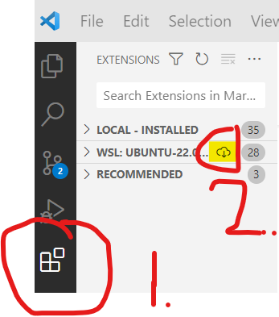

# Importing and exporting extensions

## WSL

- See the Makefile in parent directory for commands. On Windows, you may have to copy commands into git bash, since `make` is not available outside WSL.
- If using WSL:
  - It is recommended to perform these tasks outside of WSL (but using git bash), and then simply click the button in VSCode to install all extensions in WSL:

    

    See [here]](<https://code.visualstudio.com/docs/remote/wsl#_managing-extensions>) for more details. Otherwise, you may miss some extensions when exporting (since not all of them are enabled in WSL by default), and the extensions may not be available outside of WSL if importing just in WSL.
